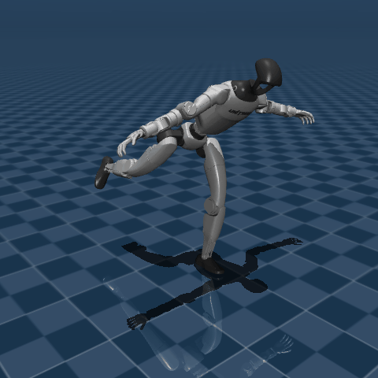

# 🚀 Trajectory Optimization Benchmark for Sampling‑Based Methods

This benchmark evaluates sampling‑based trajectory optimization algorithms built on:

- ⚡ [**Hydrax**](https://github.com/vincekurtz/hydrax) – Sampling-based model predictive control on GPU.
- 🧬 [**EvoSax**](https://github.com/RobertTLange/evosax) – Evolution strategies library.
- 🤖 [**MuJoCo‑XLA (MJX)**](https://github.com/google-deepmind/mujoco/tree/main/mjx) – GPU batched parallel rollouts.

## 🎥 Visualizations of Open‑Loop Trajectory Optimization Solutions

*All solutions were generated using ****2048 samples**** and ****200 iterations****.*

| MPPI | MPPI-CMA | MPPI-CMA Block Diagonal |
|:----:|:-------------:|:------------------:|
|  |  |  |
|  |  |  |
|  |  |  |


## 🗂️ Supported Algorithms

| Algorithm                | Description                                         | Available option strings                                     |
| ------------------------ | --------------------------------------------------- | ------------------------------------------------------------ |
| **MPPI**                 | Model‑Predictive Path‑Integral                      | `"MPPI"`, `"MPPI lr=<0.1>"`                                  |
| **MPPI‑CMA**             | MPPI with Covariance Matrix Adaption                | `"MPPI_CMA lr=(1.0, 0.1)"`, `"MPPI_CMA lr=(0.1, 0.1)"`       |
| **MPPI‑CMA‑BD**          | MPPI with Block‑diagonal Covariance Matrix Adaption | `"MPPI_CMA_BD lr=(1.0, 0.1)"`, `"MPPI_CMA_BD lr=(0.1, 0.1)"` |
| **Randomized Smoothing** | Gaussian smoothing                                  | `"RandomizedSmoothing lr=<0.1, 0.01, 1>"`                    |
| **CMA‑ES**               | Canonical evolution‑strategy baseline               | `"CMA-ES"`                                                   |
| **Predictive Sampling**  | Sample & Choose the best                            | `"PredictiveSampling"`                                       |
| **Your algorithm**       | Edit `algorithm.py` to add it                       |                                                              |

> **Tip 💡** Learning‑rates need be modified in `algorithm.py` by adding a new option; all other parameters (e.g., samples, horizon, σ, temperature, spline settings) can be adjusted directly inside `benchmark.ipynb`.

## 🗺️ Supported Tasks

| Difficulty | Tasks                                            |
| ---------- | ------------------------------------------------ |
| ⭐ Easy     | `CartPole`, `InvertedPendulum`, `DoubleCartPole` |
| ⭐ Hard     | `PushT`, `HumanoidBalance`, `HumanoidStandup`                   |

## 🛠️ Setup

### 1. Create and activate conda environment

```bash
conda create -n benchmark python=3.12
conda activate benchmark
conda install pip
```

### 2. Install dependencies

Navigate to the project directory and install packages:

```bash
cd traj_opt

# Install Hydrax and EvoSax without their dependencies
pip install --no-deps git+https://github.com/vincekurtz/hydrax@63c715d#egg=hydrax
pip install --no-deps evosax==0.2.0

# Install remaining dependencies with JAX CUDA support
pip install -r requirements.txt --extra-index-url https://storage.googleapis.com/jax_releases/jax_cuda_releases.html
```

### 3. Verify Hydrax installation

Run Hydrax's test suite to ensure proper installation:

```bash
# Create temporary directory and clone Hydrax
tmpdir=$(mktemp -d)
git clone https://github.com/vincekurtz/hydrax.git "$tmpdir"
git -C "$tmpdir" checkout 63c715d

# Run tests
pytest -v "$tmpdir/tests"

# Clean up
rm -rf "$tmpdir"
```
### 4. Run the benchmark demo 🎮

```bash  
python demo.py --task DoubleCartPole --algorithm "MPPI_CMA lr=(1.0, 0.1)"  --max-iterations 100 --num-samples 1024 --visualize --xla-deterministic 
```

### 4. Play with the benchmark notebook 🎮

Open `benchmark.ipynb` to explore the benchmark, adjust parameters, plot convergence, and visualize roll‑outs.

## 🧪 Testing

### Test GPU determinism

```bash
pytest tests/test_deterministic_rollouts_gpu.py
```

### Run full test suite (optional)

Run all algorithm tests except the deterministic‑rollout check:

```bash
pytest --ignore=tests/test_deterministic_rollouts_gpu.py
```

## ⚠️ Important Notes

### Determinism Requirements

For reproducible benchmarks, MuJoCo‑XLA (MJX) must run deterministically. This requires:

- Setting the XLA flag: `--xla_gpu_deterministic_ops=true`
- Using **JAX ≤ 0.4.34** for reliable deterministic behavior with MJX

**Version Conflict**: The deterministic flag works reliably with JAX ≤ 0.4.34 (see [jax‑ml/jax#27796](https://github.com/jax-ml/jax/issues/27796)), but Hydrax and EvoSax pinned newer JAX versions. After downgrading, run the Hydrax tests above to confirm nothing breaks.
